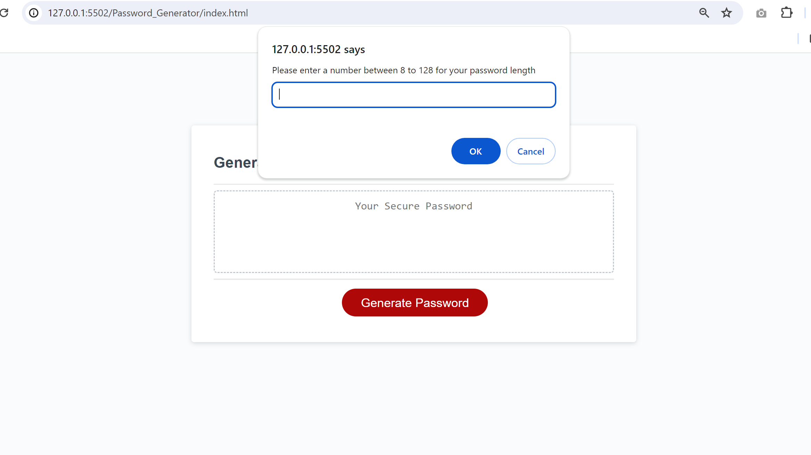
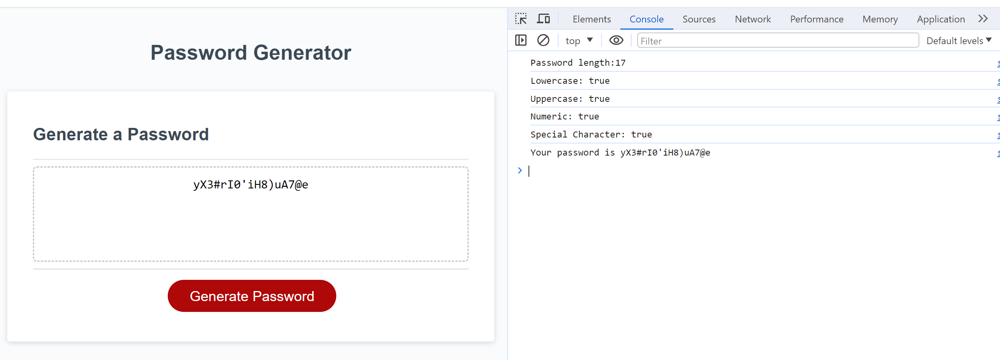

# Password_Generator
An application that an employee can use to generate a random password based on criteria that they have selected. 

## Description

Allowing an employee to use the application to choose password length and a choice of characters they wish to use and  generate a random password based on criteria that they have selected. 
The user can choose betwen 8-128 character password with a various 
combination of character types such as upper case, lowercase, numbers and special characters.

Learnings:
- Not using "for loop" for all situations. I had a bug because of using the wrong loop type! 
- Organising work is really helpful. For example, I found writing psudocode prior to writing code as a helpful exercise to think about my approach. I used the issues feature in github as a checklist to ensure all requirements were met while writing the code.

## Table of Contents 

- [Installation](#installation)
- [Usage](#usage)
- [Credits](#credits)
- [License](#license)

## Installation
### Application
 Click this link to see the password generator application:
 https://sumzulfikar.github.io/Password_Generator/
### Steps
Below is the screenshot for the password generating application

- Click Generate Password button
- The user will receive a popup asking to enter a number between 8-128
- There will a series of popups asking user to confirm which character type they would like to include for the password
- Once completed the application will show the passowrd generated in Generate a Password in the Application.
- To view what input the user provided Right click on the application and select Inspect. The console log view lists the choices made by user and the password generated.
### Result
Below is the screenshot for how result appears after following above steps.

## Credits

Reviewing the examples in the class materials, TA structured after class sessions were helpful aid to this challenge.  
The TAs after class helped me with the concepts and debugging codes when I got stuck.
Xpert learning assistant was helpful outside office hours.

## License

MIT License

## Badges

## Features

Built by HTML, CSS and JavaScript.

## How to Contribute

n/a

## Tests

Acceptance Criteria met:
- Invalid input for password length alerts user to input a number between 8-128 for password length
- If no character choices are entred by user the application alerts user of including at least one character type
- Based on user choice characters are randomised
- A random password is generated with user choices with the correct length chosen by user

